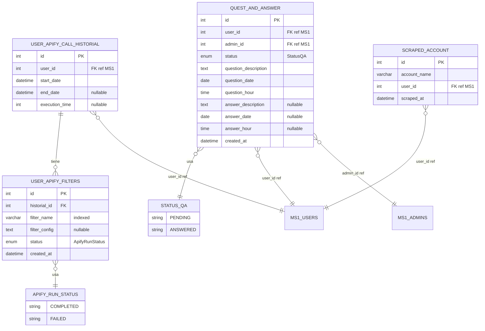

# 📊 MODELO ENTIDAD-RELACIÓN - MICROSERVICIO QA API

## 🎨 DIAGRAMA VISUAL (Mermaid)



---

## 🗂️ ENTIDADES (Formato Texto)

### 1. **QUEST_AND_ANSWER** (Sistema de Preguntas y Respuestas)
```
┌─────────────────────────────────────┐
│           QUEST_AND_ANSWER          │
├─────────────────────────────────────┤
│ PK │ id                    │ INT    │
│    │ user_id              │ INT    │ ← FK (referencia externa a MS1)
│    │ admin_id             │ INT    │ ← FK (referencia externa a MS1)
│    │ status               │ ENUM   │ ← StatusQA (PENDING/ANSWERED)
│    │ question_description │ TEXT   │
│    │ question_date        │ DATE   │
│    │ question_hour        │ TIME   │
│    │ answer_description   │ TEXT   │ ← NULLABLE
│    │ answer_date          │ DATE   │ ← NULLABLE
│    │ answer_hour          │ TIME   │ ← NULLABLE
│    │ created_at           │ DATETIME│
└─────────────────────────────────────┘
```

### 2. **SCRAPED_ACCOUNT** (Cuentas Scrapeadas)
```
┌─────────────────────────────┐
│      SCRAPED_ACCOUNT        │
├─────────────────────────────┤
│ PK │ id           │ INT     │
│    │ account_name │ VARCHAR │
│    │ user_id      │ INT     │ ← FK (referencia externa a MS1)
│    │ scraped_at   │ DATETIME│
└─────────────────────────────┘
```

### 3. **USER_APIFY_CALL_HISTORIAL** (Historial de Llamadas Apify)
```
┌─────────────────────────────────┐
│   USER_APIFY_CALL_HISTORIAL     │
├─────────────────────────────────┤
│ PK │ id              │ INT     │
│    │ user_id         │ INT     │ ← FK (referencia externa a MS1)
│    │ start_date      │ DATETIME│
│    │ end_date        │ DATETIME│ ← NULLABLE
│    │ execution_time  │ INT     │ ← NULLABLE (segundos)
└─────────────────────────────────┘
```

### 4. **USER_APIFY_FILTERS** (Filtros de Configuración Apify)
```
┌─────────────────────────────────┐
│      USER_APIFY_FILTERS         │
├─────────────────────────────────┤
│ PK │ id              │ INT     │
│ FK │ historial_id    │ INT     │ ← FK → USER_APIFY_CALL_HISTORIAL.id
│    │ filter_name     │ VARCHAR │ ← INDEXED
│    │ filter_config   │ TEXT    │ ← NULLABLE
│    │ status          │ ENUM    │ ← ApifyRunStatus (COMPLETED/FAILED)
│    │ created_at      │ DATETIME│
└─────────────────────────────────┘
```

## 🔗 RELACIONES

### Relación Principal:
```
USER_APIFY_CALL_HISTORIAL (1) ─────────── (N) USER_APIFY_FILTERS
     │                                              │
     │ PK: id                                       │ FK: historial_id
     └──────────────────────────────────────────────┘
```

**Tipo**: One-to-Many (1:N)
- Un historial de llamada puede tener múltiples filtros
- Un filtro pertenece a un solo historial
- **CASCADE DELETE**: Si se elimina un historial, se eliminan sus filtros

### Referencias Externas (Sin FK físicas):
```
┌─────────────────┐    user_id    ┌──────────────────────────────┐
│   MICROSERVICIO │ ─────────────→│   QUEST_AND_ANSWER           │
│       1 (MS1)   │               │   SCRAPED_ACCOUNT            │
│   (Usuarios)    │               │   USER_APIFY_CALL_HISTORIAL  │
└─────────────────┘               └──────────────────────────────┘
```

## 📋 ENUMS

### StatusQA
```
┌─────────────┐
│  STATUS_QA  │
├─────────────┤
│ PENDING     │ ← Pregunta sin responder
│ ANSWERED    │ ← Pregunta respondida
└─────────────┘
```

### ApifyRunStatus
```
┌──────────────────┐
│ APIFY_RUN_STATUS │
├──────────────────┤
│ COMPLETED        │ ← Ejecución exitosa
│ FAILED           │ ← Ejecución fallida
└──────────────────┘
```

## 🎯 RESUMEN DE CARDINALIDADES

| Entidad A | Relación | Entidad B | Cardinalidad |
|-----------|----------|-----------|--------------|
| USER_APIFY_CALL_HISTORIAL | tiene | USER_APIFY_FILTERS | 1:N |
| MS1 (Usuarios) | referencia | QUEST_AND_ANSWER | 1:N |
| MS1 (Usuarios) | referencia | SCRAPED_ACCOUNT | 1:N |
| MS1 (Usuarios) | referencia | USER_APIFY_CALL_HISTORIAL | 1:N |
| MS1 (Admins) | referencia | QUEST_AND_ANSWER | 1:N |

## 🔍 ÍNDICES

- **USER_APIFY_FILTERS.filter_name** → Índice para búsquedas rápidas
- **Primary Keys** → Índices automáticos
- **Foreign Keys** → Índices automáticos

## 📝 NOTAS IMPORTANTES

1. **Microservicio**: Este MS2 no maneja usuarios directamente, solo referencias por ID
2. **Cascade Delete**: Eliminar historial elimina sus filtros automáticamente
3. **Timestamps**: Todas las entidades tienen control de fechas/tiempo
4. **Nullable Fields**: Campos opcionales marcados apropiadamente
5. **Enums**: Estados controlados por enumeraciones para consistencia
